## Introduction to Terraform

### Terraform
is an infrastructure as code (IaC) tool that lets you define, provision, query and manage cloud resources using a declarative configuration language. Instead of clicking through the AWS console or writing complex API calls, you write code that describes your desired infrastructure, and Terraform handles all the API calls and sequencing needed to make it happen.

#### Goals for class
- Verify computer is set up correctly
- Build VPC with the extras using Terraform

#### Prereqs
-   note I am using a mac  
 
# 1. Run this command in Terminal 
- curl https://raw.githubusercontent.com/aaron-dm-mcdonald/Class7-notes/refs/heads/main/101825/check.sh | bash

for mac users seems to get stuck? It says <mark>end</mark> but you are unable to type so hit control+c to <mark>end</mark> what is running and complete the check
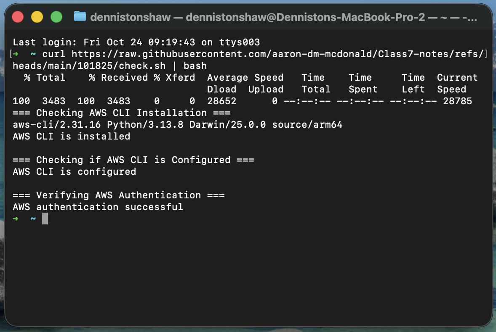

---
### What the preceeding script does

checks the following:
- AWS CLI installed, configured and authenticated
- Terraform binary is installed and up to date
- TheoWAF folder present at ~/Documents/TheoWAF/class7/AWS/Terraform
- Creates a .gitignore file

It will create the TheoWAF folder structure if needed and will download a .gitignore file configured for Terraform projects.

# 2. Got to the Terraform folder in Terminal  
cd ~/Documents/TheoWAF/class7/AWS/Terraform/  

make sure you have a .gitignore file which is created when you ran the curl command

### create a directory in Terraform  
- mkdir 10-24-25_wk6-tf-lab (working folder)  
### create files in that folder
- touch 0-auth.tf
- touch 1-vpc.tf

### copy .gitignore file from Terraform folder to working folder

Terminal view
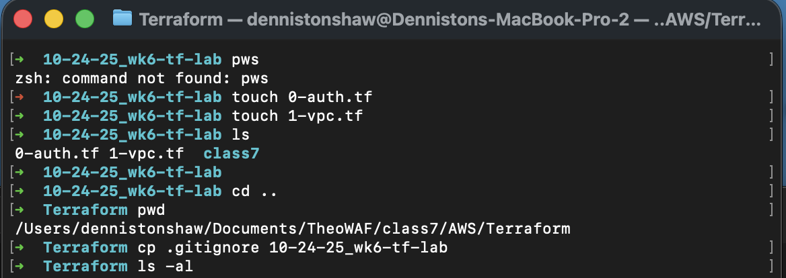

Finder view

# 3. Make sure I forked Theo's github folder updated class7

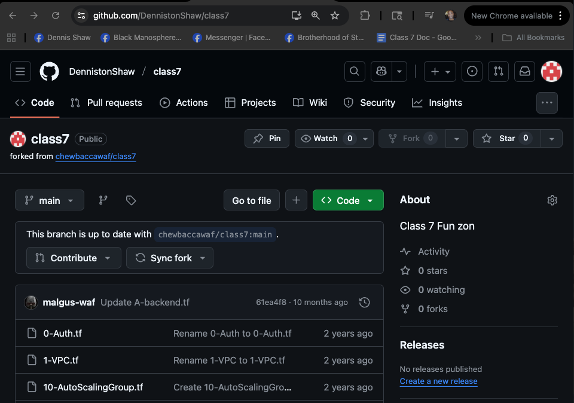 

I can add these files directly to my Terraform folder
- in github go to code and copy url
- in Terminal command "working folder"

 

open vscode by 
- typing command "code ." in your terminal  
- then you can close the terminal and work out of vscode

 

#### *alternatively the all Terraform scripts can be found in at the [Terraform registry](https://registry.terraform.io/browse/providers?tier=official)
- got to the AWS provider
- upper right side click use provider

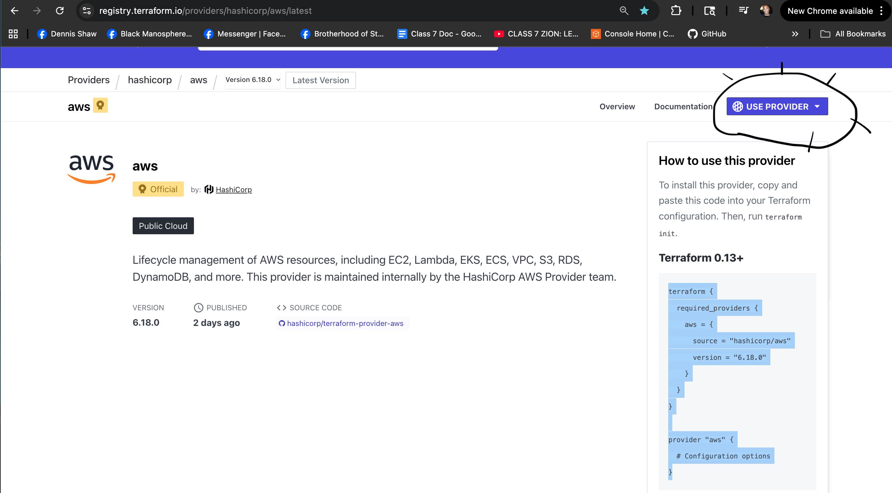 

- in vscode copy and paste script into the 0-auth.tf file
- *every terraform deployment will need a terraform code blocks
you should have provider blocks in every one.
- put default region under provider in the code  
>>>> "# default region  
region= "us-east-1"

you can put other things as well. take a look in the registry to learn more by going to the Documentation section beside the use provider on the website
 
  
- SAVE when your done *see the white dot beside the name in editor shows that it has not been saved

---

### Terraform Workflow (commands)
IVPAD (init, verify, plad, apply, destroy)

|Terraform Command|Action|
|-|-|
|terraform init|Downloads provider plugins, generates lock file, etc|
|terraform validate|Validate HCL syntax and configuration (check your "grammar", not if it "makes sense" otherwise known as semantically correct)|
|terraform plan|Show execution plan: preview what will change|
|terraform apply|Apply changes: actually create/modify/destroy infrastructure|
|terraform destroy|Destroy all resources managed by this configuration. Run only when finished with the lab|

CLI documentation: [Terraform CLI Commands](https://developer.hashicorp.com/terraform/cli/commands)

---
### terraform version
### terriform init

- sucessfull created a .terraform.lock.hcl file

### terraform validate
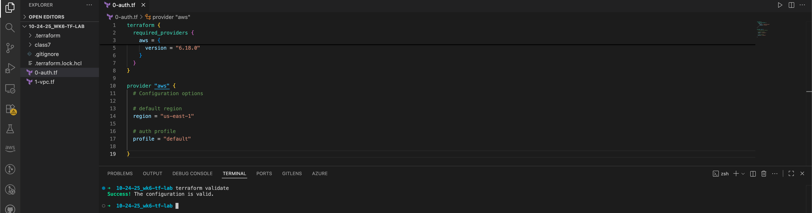

now Terraform is ready to make infrastructure now we go to the 1-vpc.tf aka we've also used 1-main.tf in other classes.

- terraform website/providers/aws/documentation
- scroll down aws documentation on the left and find VPC (Virtual Private Cloud) which gives you two cloud block sublists: Resources and Data

#### Resources  
- makes things in the cloud

#### Data Sources
- searches or queries the cloud and gives you information

go to Resource
go to aws vpc

### terraform plan
### terraform apply
- successfull created a terraform.tfstate file  

  

root VPC = 10.72.0.0/16

public A = 10.72.1.0./24  
public B = 10.72.2.0/24  
public C = 10.72.3.0/24  
public D = 10.72.4.0/24

private A = 10.72.11.0./24  
private B = 10.72.12.0/24  
private C = 10.72.13.0/24  
private D = 10.72.14.0/24

- go to class7 files and copy the script from 1-VPC.tf and past in your file  

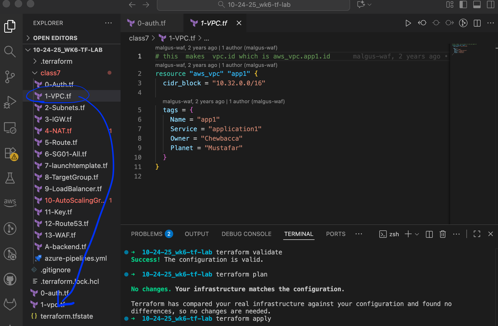
- changes to the script: changed app1 to main, cidr block, name, erased service, owner, planet and changed tag

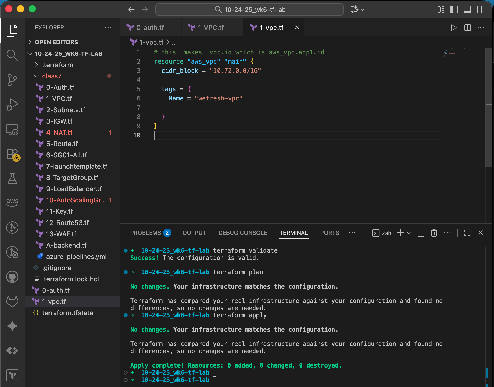
- save
- terraform validate 
- success

- terraform plan - *which adds the name

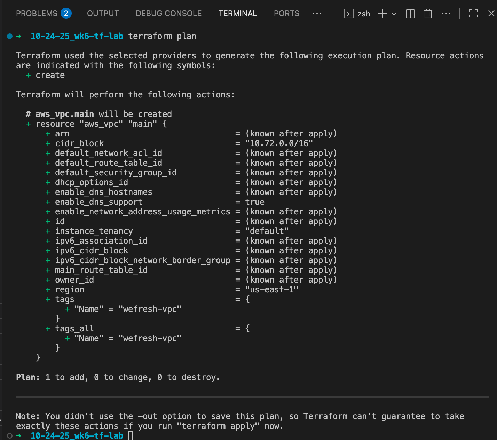
- terraform apply
>>>- it then will ask you to type 'yes' to accept

go to AWS to double check that your VPC was created
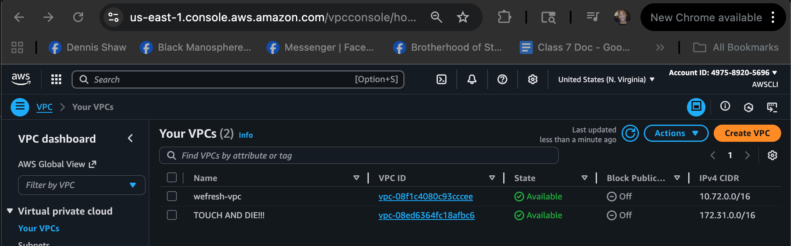

add a file touch 2-subnets.tf
copy and past script from subsequent class7 file into the new file

## input my information into the 2-subnets.tf

- change the availability zones. To replace all instances command+f write the zone click the dropdown menu to the left write the new zone

- vpc_id must match our vpc or it can't find it. I will change  *vpc_id  = aws_vpc.app1.id* to *vpc_id = aws_vpc.main.id*

- eu-west-1 turns into us-east-1
- cider block has to match your cider block

### terraform validate
### terraform plan
- don't worry about the note: you didn't use the -out option to save this plan...... will be explained at a later date
### terraform apply
- will ask if you want to accept type yes  

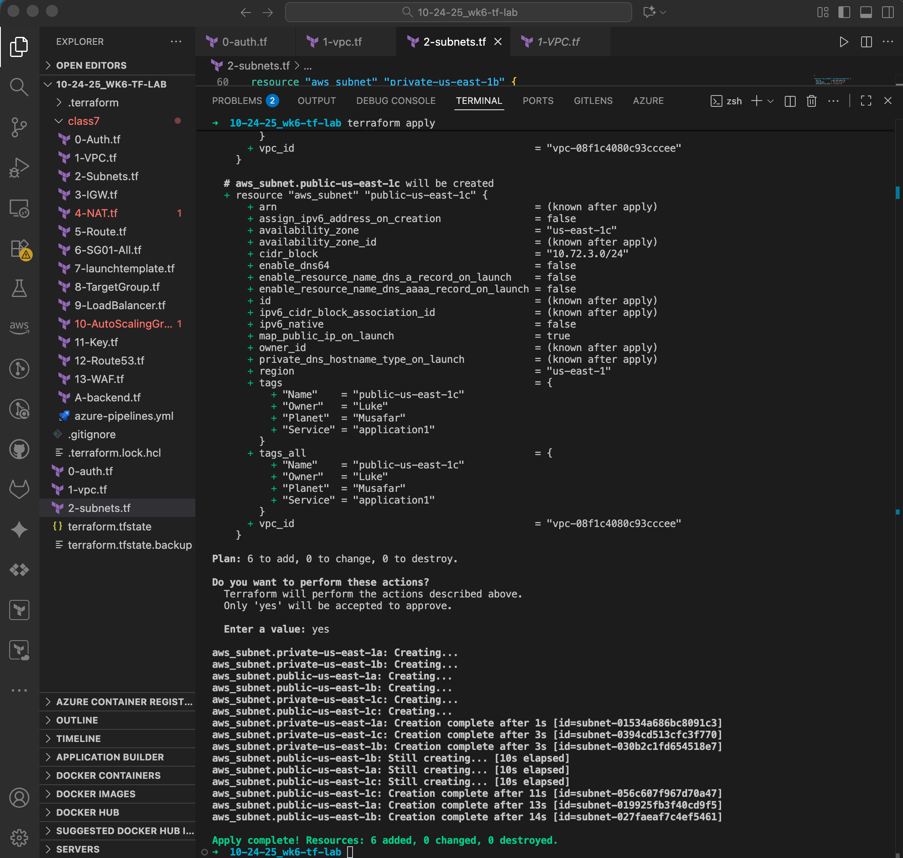

to check go to AWS vpcs and into subnets

create new tf file 
- touch 3-IGW.tf
- touch 4-NAT.tf
- touch 5-Route.tf

### copy 3-IGW.tf script to my file  
- *carefully look at your code make sure your vpc_id is correct  

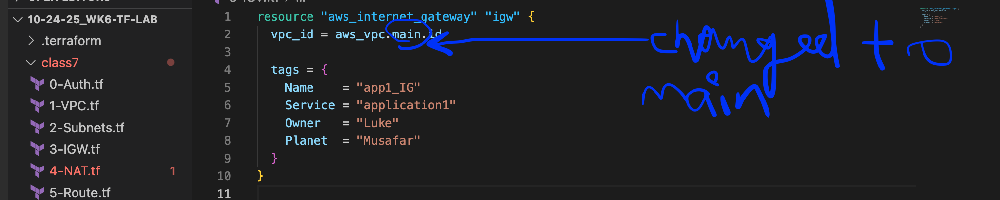
Save

### terraform validate  
### terraform plan  
### terraform apply 
- 'yes'  

  

### copy 4-NAT.tf script to my file
- remove line 2 vpc = true *its old Theo code

  
- Save

## IVPAD
### terraform validate  
### terraform plan  
### terraform apply 
- 'yes'  

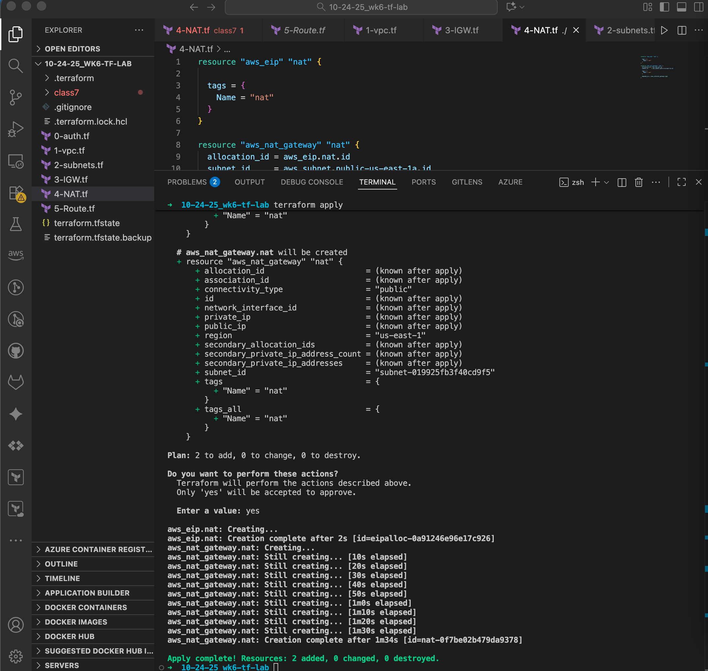

### copy 5-Route.tf script to my file
- change vpc_id name to match mine
- all vpc_id = aws_vpc.app1.id to vpc_id = aws_vpc.main.id 
- change the availability zones
- *note route table associations attaches the route tables that you created to a subnet

SAVE

## IVPAD
### terraform validate  
### terraform plan  
### terraform apply 
- 'yes'  

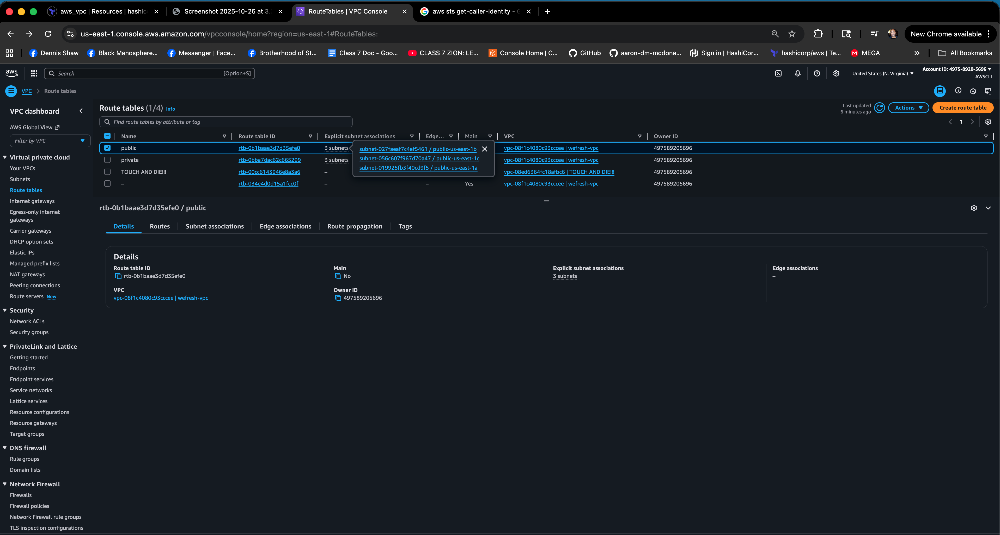

- you can see everything you've built up so far by using command terraform state list. this list everything you've built in the state file

- will ask if your sure 'yes'

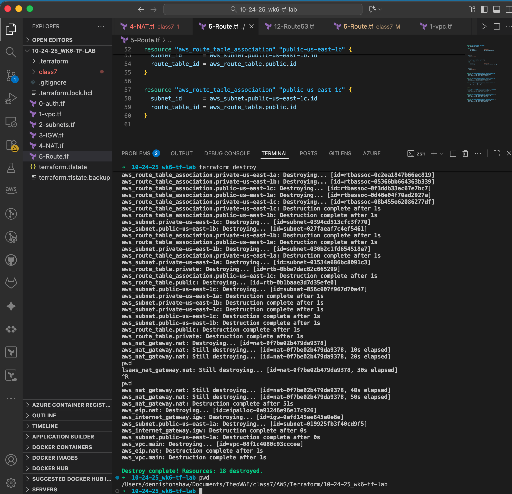
