# Class7 11-30-25 - Sunday  
- week 12 (Terraform pt7): s3, remote state, and SNS

### Things we will do today:
- goal = host the state file within an S3 bucket, and receive SNS notifications for scaling events
  
### Deliverables  
  - screenshots of remote state and SNS email notification
##

### https://developer.hashicorp.com/terraform/language/state/backends

Backend code defines where you tell Terraform where to stores its state data files. If you don't tell Terraform where to store the state file it will assume by default it's stored in the local option
- https://developer.hashicorp.com/terraform/language/backend/local 

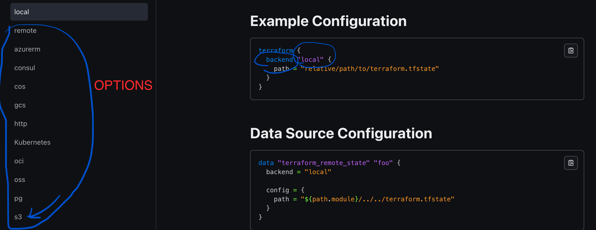

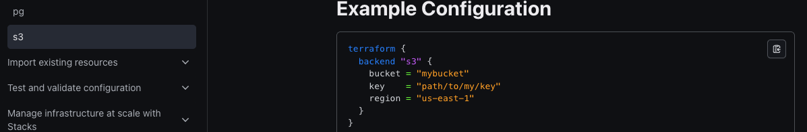

We need a different backend, not local. There are many options. For now we will use s3.
It's a terraform code block. You can go into your Auth file and write in a 2nd terraform code block 

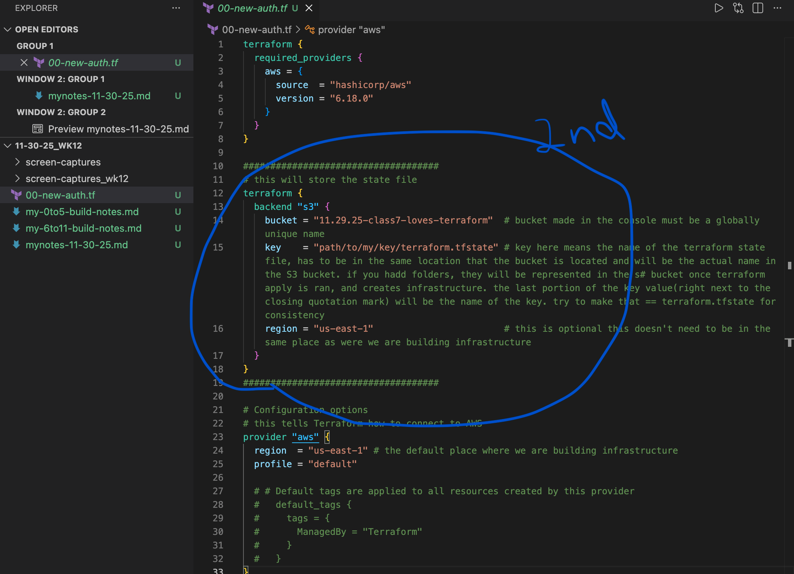

*note: your provider and your backend are independent of each other. You can have them in different zones, regions, even different AWS accounts.

Keep in mind you have to set up your s3 bucket first because you need to ensure that the name is available. It has to be globally unique.

You can't use Terraform to create your BACKEND bucket because the BACKEND bucket has to be created first. So if you terraform init your bucket hasn't been created first. So lets go to the AWS console and set up our s3 BACKEND bucket.

# Create s3 Bucket in AWS Amazon
- got to AWS console Amaxon S3 > Buckets > Create Buckets (*if a change is not mentioned leave it on the default)
- Bucket name 11.30.25-class7-droppin-buckets
  
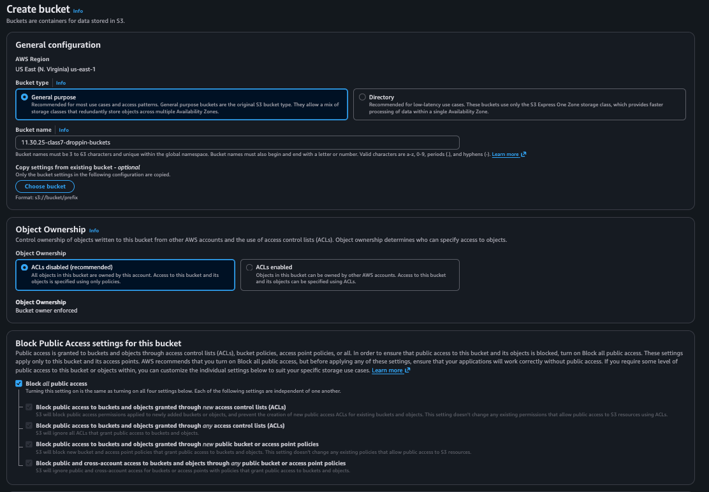

- Bucket Versioning - we want this enabled (Versioning is a means of keeping multiple variants of an object in the same bucket)
- Tags (optional)
  

- ORANGE BUTTON! create bucket
  
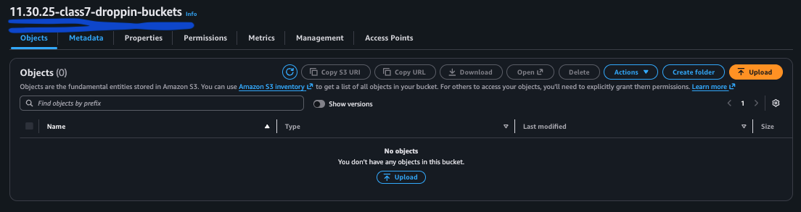

- if your bucket name was created it was unique and accepted so copy bucket name and paste it in your terraform backend block s3

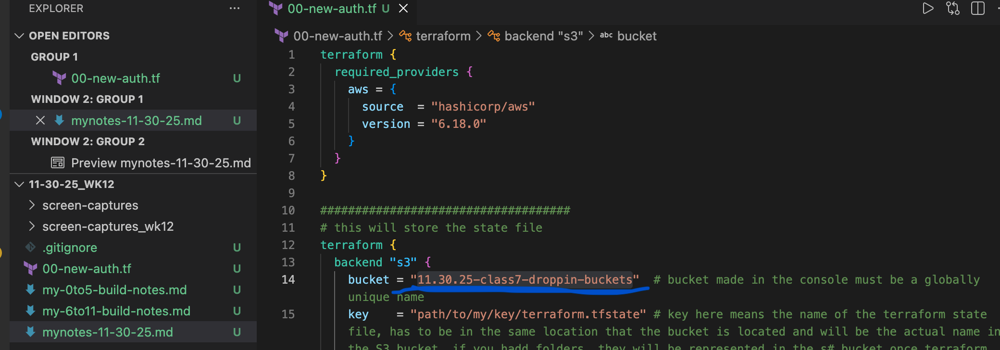

IMPORTANT! You're going to re use your bucket so you want your key to be unique for each Terraform project if you re use a name you will overwrite the previous file.
    - go to key and create a unique name
    - S3 is flat so there are no folders or heirarchy in some documentation it mentions folders but this is only to help us visualize
    - we can make it kind of look like folders by using forward slashes in our naming
    - ie. "state/113025/terraform.tfstate" but you can use whatever you want
    - verify you use the same region you set up your s3 in.

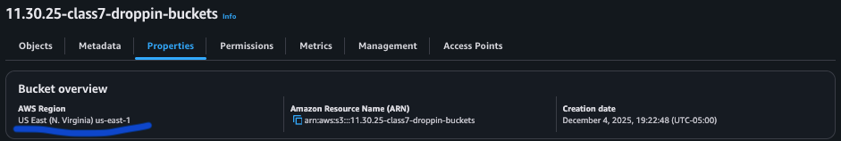

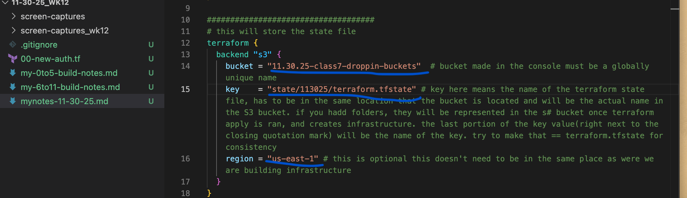

You can now IVPADD
        - side note:previously terraform never checked your credentials with terriform init because everything terraform was done locally but now that you have created a backend in AWS it will verify who you are during the init stage

*notice there is no terraform.tfstate file after running IVPAD. This is because we replaced the local backend with the s3 backend *remember the default is to store it locally.

verify the changes in the s3 bucket in the console
- got to Amazon S3 > Buckets > objects > refresh page

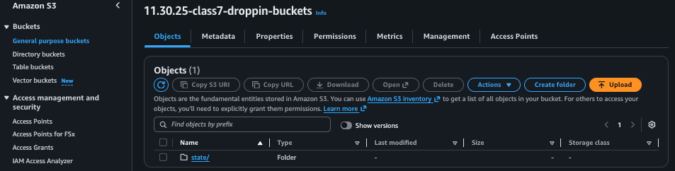

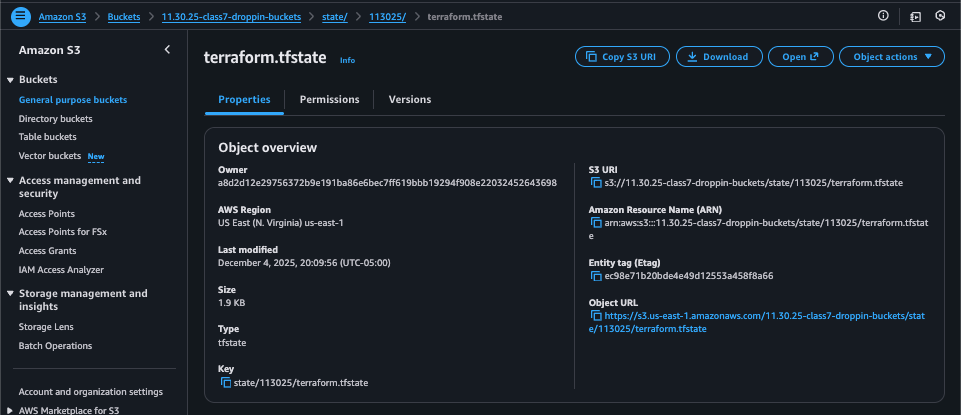

*Don't change the backend s3 block of code after you've run init because then you would have to tell terraform how to manage the changes in state and run init again.

now copy the rest of the .tf files into vscode and run IVPAD again

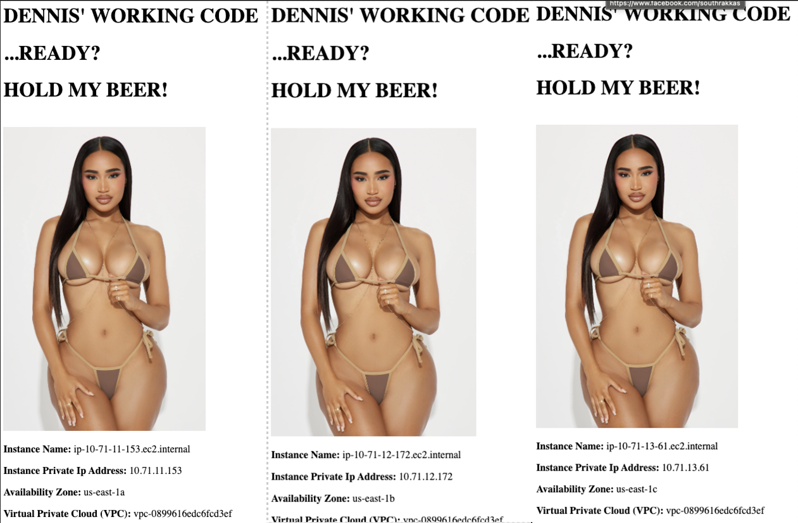

## Three things we did in the console last class that to get email notifications
  1) SNS topic
  2) subscription - how we configure how we get a notification
  3) resource that publishes notification today we will get notifications of our autoscaling group when it has scaling events

let's do this in Terraform
- create an 11-notification.tf file
- first we go to the Terraform registry > provider > AWS > Documentation
### 1) Search "topic" then go to resources then aws_sns_topic
   - https://registry.terraform.io/providers/hashicorp/aws/latest/docs/resources/sns_topic 
   - when we set this up in the council we used default settings so let's copy the default code

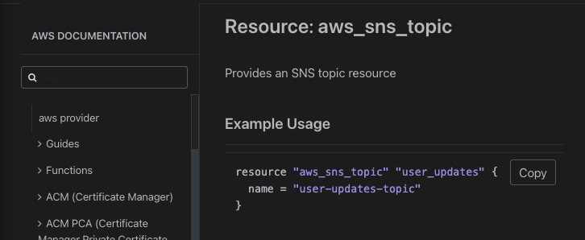

### 2) Go to aws_sns_topic_subscription 
   - https://registry.terraform.io/providers/hashicorp/aws/latest/docs/resources/sns_topic_subscription
   - go to the Example usage and copy the part of the code with the topic subscription and paste in notification
  
  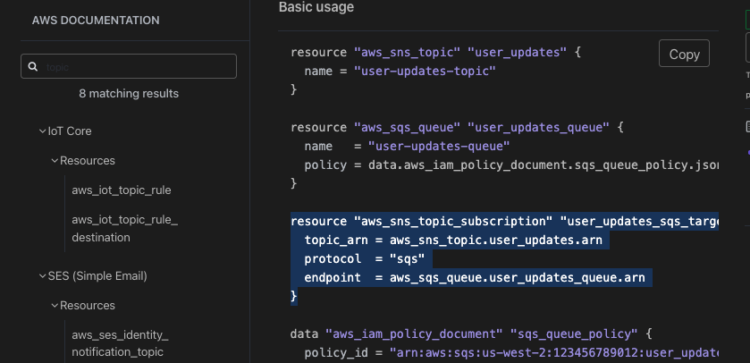

 change the names in resources and topic arn
 we need the argument for protocol - go back to registry and find protocol near the bottom of the page

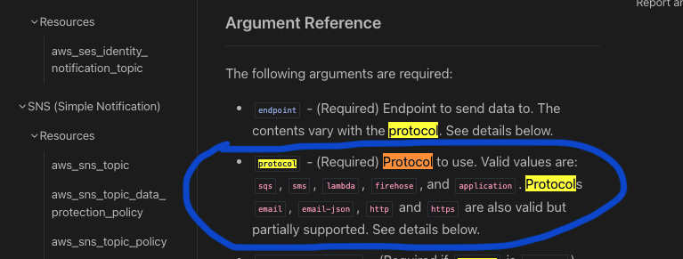

We can see protocol is required. Here we need to choose where notifications will go
*note we will choose email but it says email does not have full control. Whenever Terraform can't do something completely store or track something in it's .state file it technically isn't supported completely. If you use email terraform can make the subscription but it can't confirm the subscription for you. We have to go an confirm the email outside of Terraform's parameters.

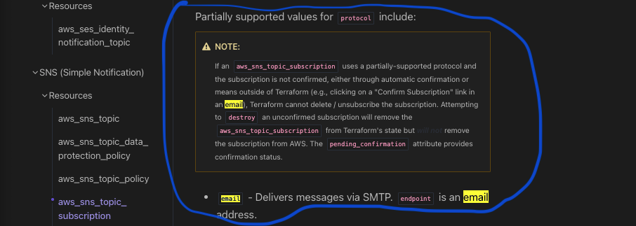
 - *note that it says endpoint is an email address, if we go back to the argument reference, right above the protocol, it says that the endpoint is required
 - go back to vscode and change the protocol argument to "email"
 - for endpoint put your email address as a string "southrakkascrew@gmail.com"

### 3) We need the thing that will publish to the topic
   - need to go back to the registry but not in SNS now we go to ASG because publishing occurs when ASG is changed
   - search auto scaling > resorces > aws_autoscaling_notification
   - https://registry.terraform.io/providers/hashicorp/aws/latest/docs/resources/autoscaling_notification
   - copy example usage: 
   - *we only need the autoscaling notification portion of this code  
  
Perform IVPAD
  
  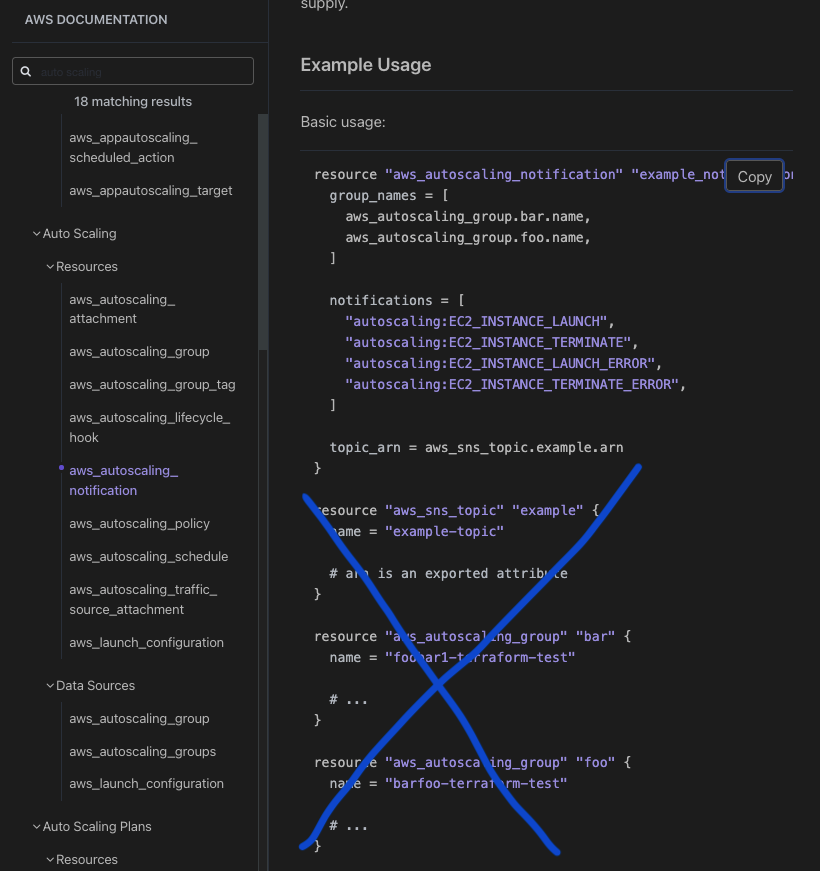

- autoscaling notification is asg-notifications
- change the name to my autoscale group's name
- only have one autoscale group so next line is not needed
- in the topic_arn = change "example" to the correct name "asg-notifications"

Perform IVPAD

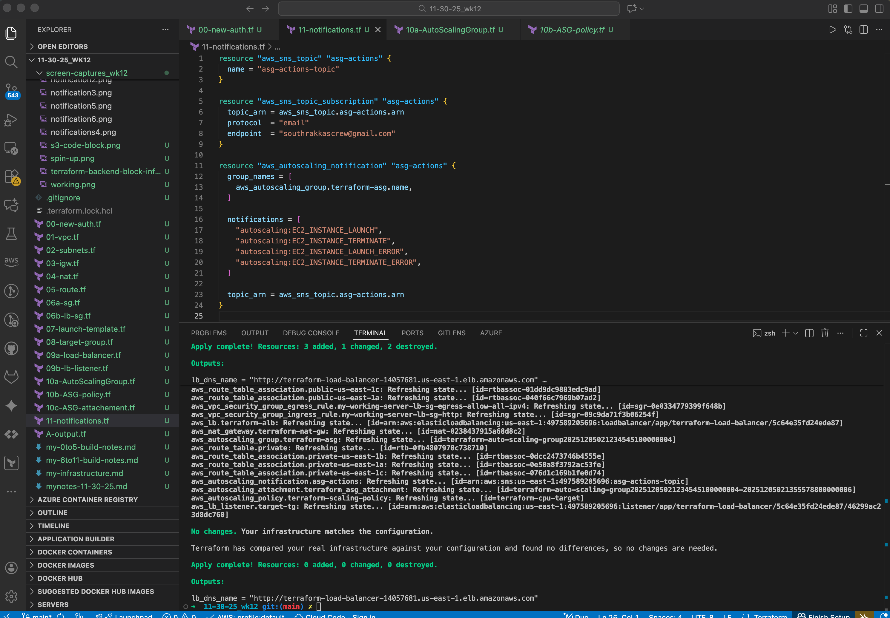

now confirm your email *check your spam

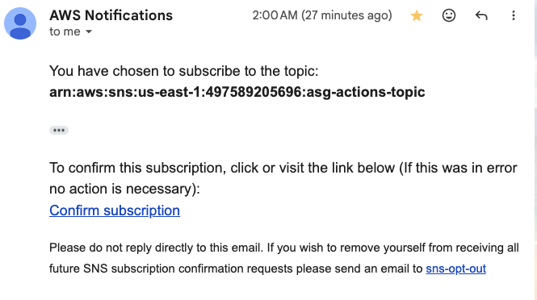  

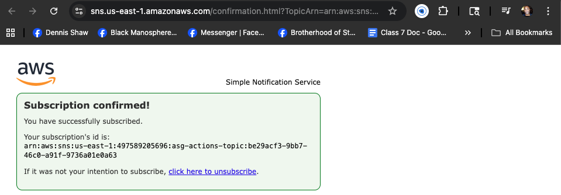

Let's confirm that notifications work by going into the AWS console and deleting and instance

Once instance is deleted checking if we got an email notification

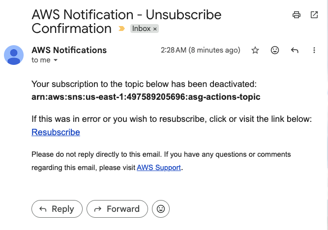

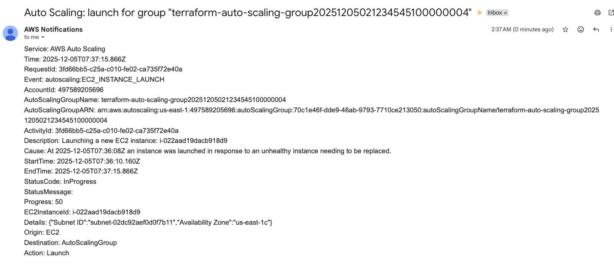

time for teardown - terraform destroy