Class7 12-02-25 Tuesday
week 13 (Terraform pt 7): S3-hosted webpage

# Today's Goal 
- create an S3 bucket
- upload a file to it
- upload an html (webpage)
- change some permissions so that the bucket has public access
- share links from the bucket so other people can access the contents of the bucket 

Deliverables - link of functional S3-hosted webpage

- s3 can host a webpage or html file
- if you have a webpage that will stay the same or not have user interaction then  you can always store it in an s3
    - ie. a 404 page

goal for today
    - [http://static-site-lab-aaronmcd.s3-website-ap-southeast-1.amazonaws.com/](http://static-site-lab-aaronmcd.s3-website-ap-southeast-1.amazonaws.com/)

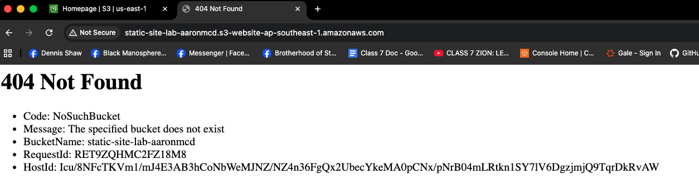

for CLI
- aws s3 cp s3://test-1256099743/lab-example/ ./lab-example/ --recursive

or

lab files from tonight can be grabbed with this:
- aws s3 cp s3://test-1256099743/lab-example/ ~/documents/TheoWAF/s3-lab-example/ --recursive

check Udemy Maarek also has a lab for creating this s3 bucket

review: 

AWS Policy Generator 
- https://awspolicygen.s3.amazonaws.com/policygen.html

Policies and permissions in Amazon S3 - Amazon Simple Storage Service
- https://docs.aws.amazon.com/AmazonS3/latest/userguide/access-policy-language-overview.html

IAM JSON policy reference - AWS Identity and Access Management
- https://docs.aws.amazon.com/IAM/latest/UserGuide/reference_policies.html

# S3 (Simple Storgage Service)
- can host a web page (html)
  - if you have a static web page, won't have user interaction, you can store this in an s3
  - in order to direct traffic from your ie. lb, route 53, DNS name, so that you can say the website is down for maintanence like a 404 error page
  - something simple that hosts an image
  - ie. https://github.com/mookiewafloveslizzo  
  
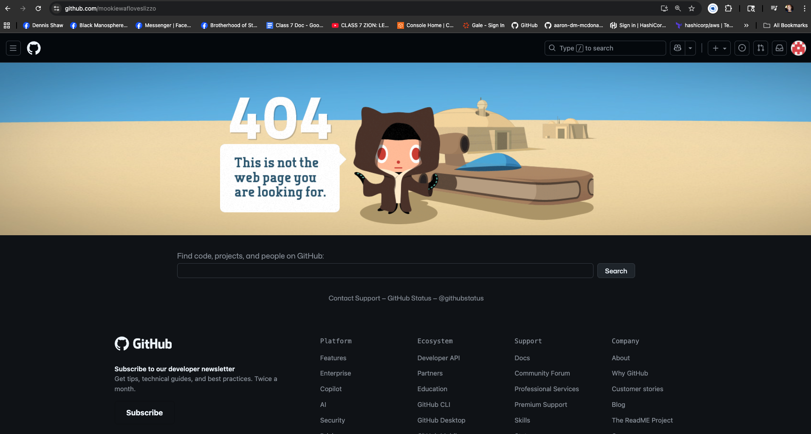

Go to the AWS console > S3
- Create bucket
- name it 
- Bucket Versioning --> enabled
- leave everything else default
- click the ORANGE BUTTON! create bucket  
  
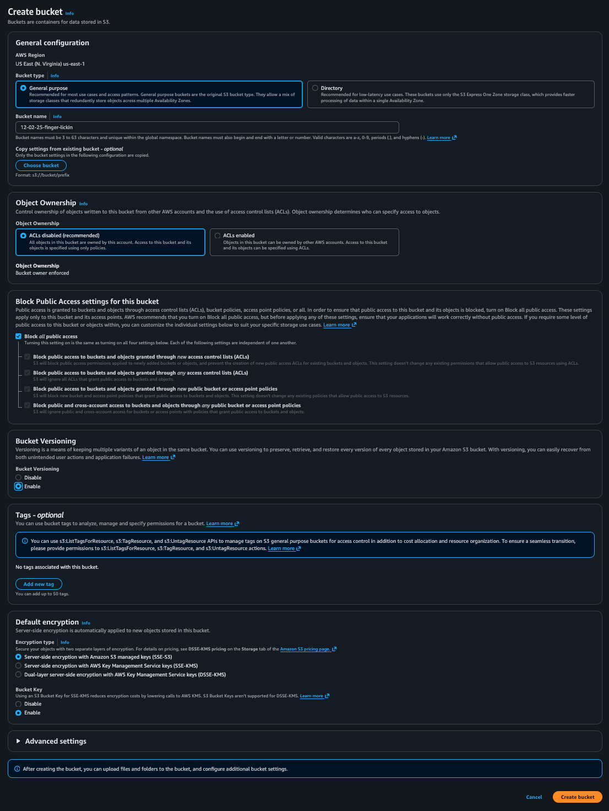

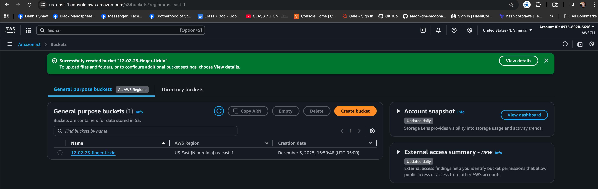

#### let's want to upload some things to our bucket
- go to bucket and click upload

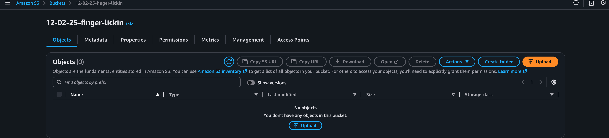
- drag and drop files or add files/folders

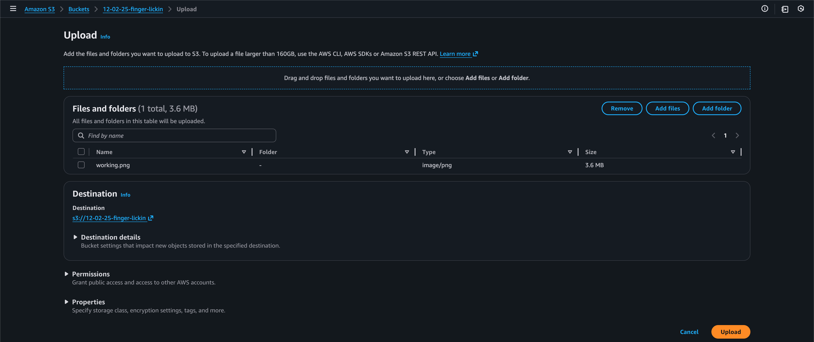
- click upload

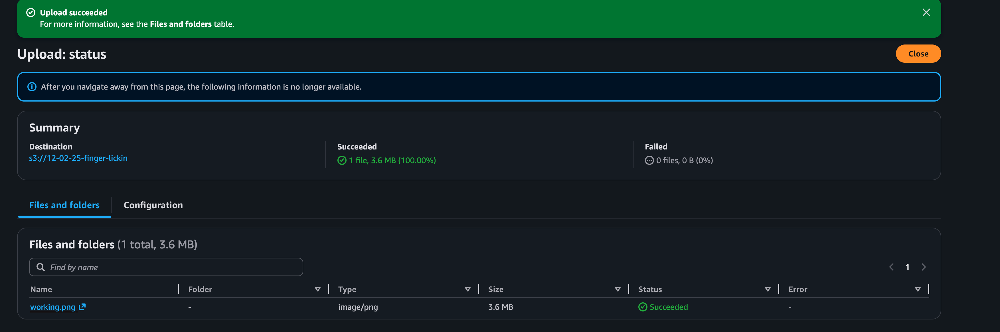
- add some pictures and an index.html
- as it stands now if we copied the
 
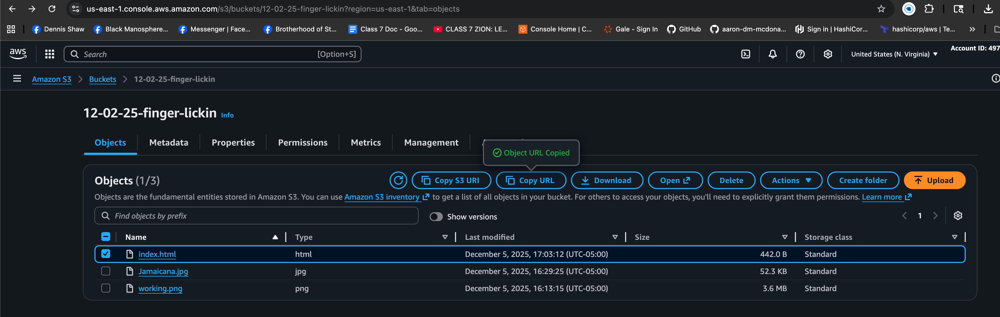 

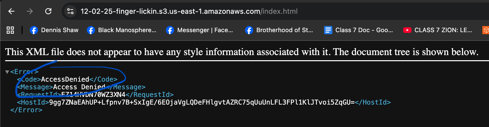
- access denied
- we need to change permissions to make this public
    - go to Properties
    - scroll down to Static website hosting > edit > enable
    - Index document: the website you are hosting will be determined by the html page you point to. I used index.html
    - save changes
  
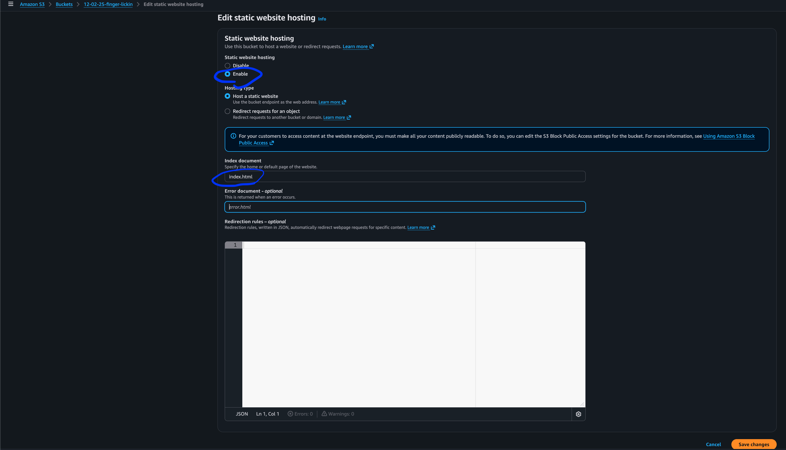

Once the the static website hosting is complete then its enabled you can scroll to the bottom of properties and see the Bucket website endpoint where it gives you the static website.

ie. https://12-02-25-finger-lickin.s3.us-east-1.amazonaws.com/index.html
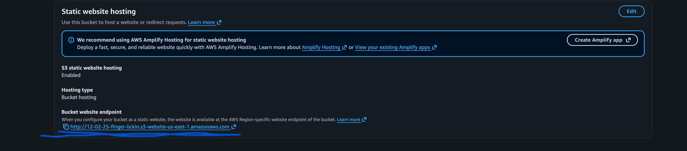
- copy, this is the deliverable
- at this point access is still denied

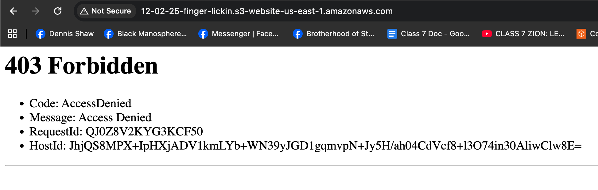
- there is still a permissions issue
- go back to your s3 bucket > permissions
- we need to change Block pulic access from on to off
    - go to edit and uncheck Block all public access, save changes, and confirm

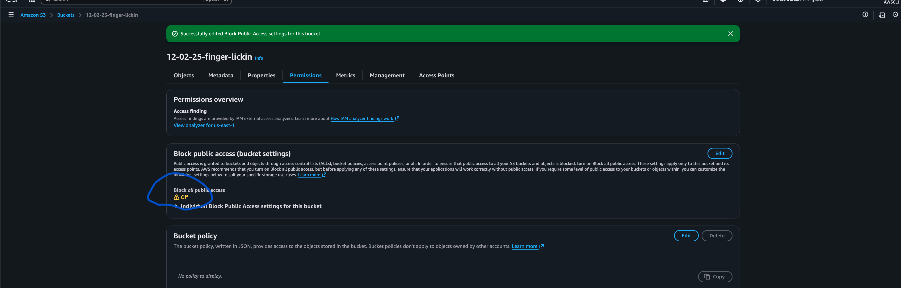

#### Next modify the Object Ownership
- scroll down in permissions and edit Object Ownership 
- choose ACLs enabled and check I acknowledge that ACLs will be restored
- and Object Ownership will be Bucket owner preferred
- Save Changes

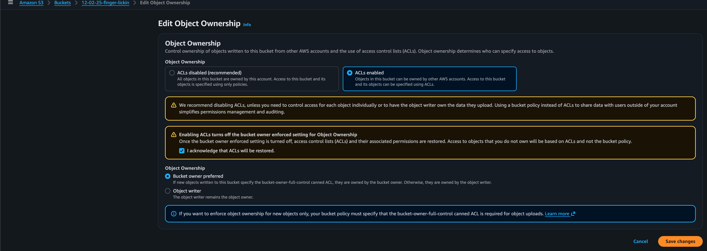

we did this so we would have access to the Access control list (ACL) and now we can edit and give the public access to the bucket
- scroll down to Access control list (ACL) > edit
- in Everyone (public access) check list and read 
- and check I understand the  effectw of these changes on my objects and buckets

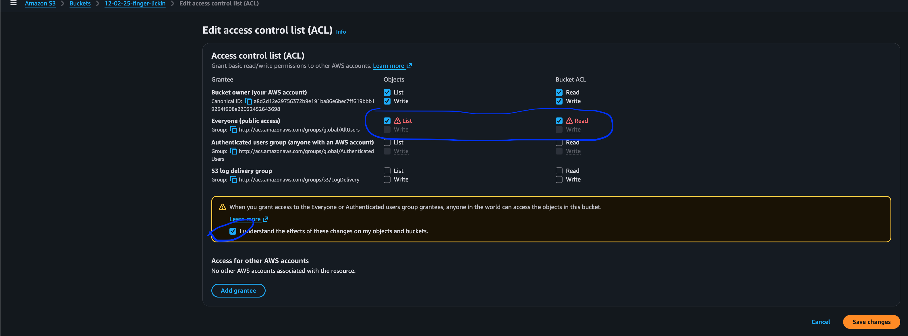

#### Lastly we need to make the objects (ACLS) visible
- go to objects we want visable > highlight them > actions > make public

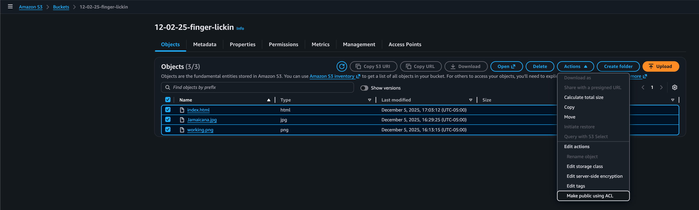

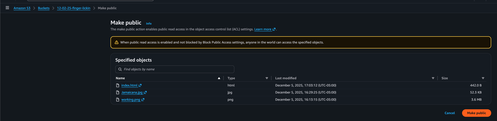

https://12-02-25-finger-lickin.s3.us-east-1.amazonaws.com/index.html
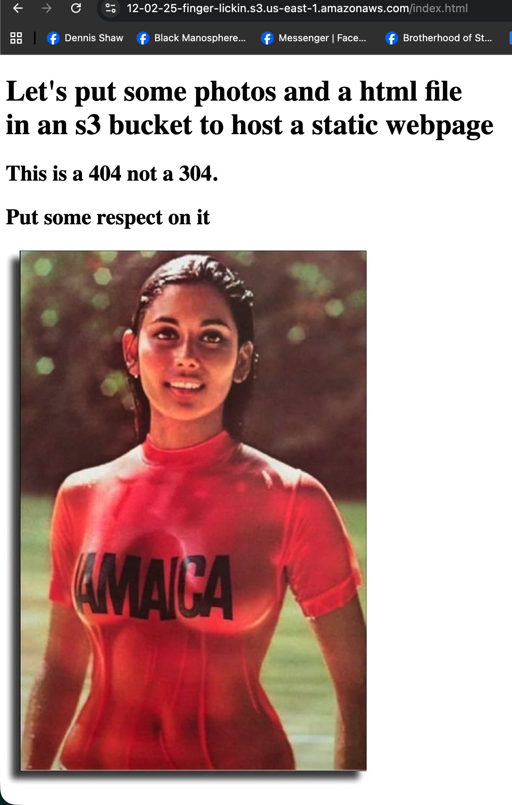