# Class 7 / 12-07-25 / Student let Sunday

week 13 (Terraform pt 7): S3-hosted webpage

goal = create a S3 bucket and host a custom public webpage

Deliverables = link of functional S3-hosted webpage

run this code to download a .jpg, index.html, and error.html file or create your own
- aws s3 cp s3://test-1256099743/lab-example/ ~/documents/TheoWAF/s3-lab-example/ --recursive

*look into pimpin out my terminal using Obsidian
https://youtu.be/xvW9WAvGlVk?si=OBUUnMa9TAvpWGzB 

- Sergino Obsidian is doing a $30 per month class

S3 static website hosting lab - first in console

http://120625-saturday-bucket.s3-website-us-east-1.amazonaws.com

###################################

# S3 static website hosting lab - in Terraform

### Create 00-auth.tf files, (for web), and .gitignore

1. Open console and go to the S3 dashboard
2. get static assets
3. create s3 bucket simple storage
4. upload assets
5. make it publically accessible
    - remove the "block all public access" setting
    - add a bucket policy
6. verify public access
7. enable statick hosting (we aren't using object endpoints)
    - set the indext and error pages

### config that "is not" default:
- disable "block all public access"
- added a bucket policy
- enable statick website hosting
- uploaded objects

### Resource to create
- s3 bucket
- s3 object (upload them to the aforementioned bucket)
- public access block (we are disabling this)
- make a policy
- static website config

### Desired output:
- static website url
- bucket name
- arn

### policy
policy = jsonencode({
    version = "2012-10-17)
})

####################################### 

steps:

# 00-auth.tf

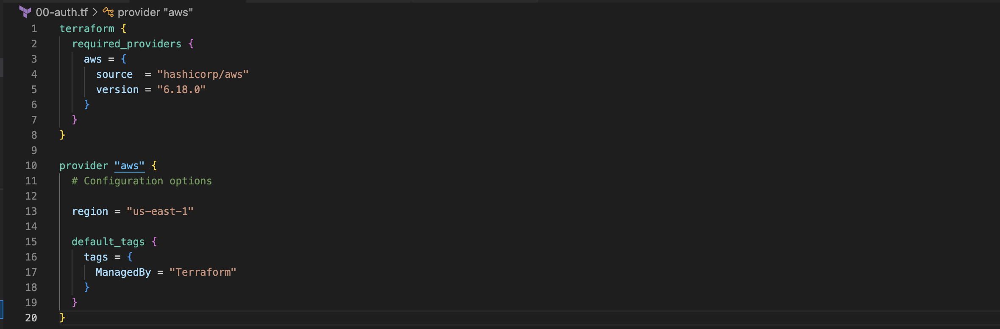

### terraform init - creates a .terraform.lock.hcl file

# 01-bucket.tf

go to registry > provider > documentation > S3 simple storage > aws s3 bucket
    - scroll down and copy the example usage
  
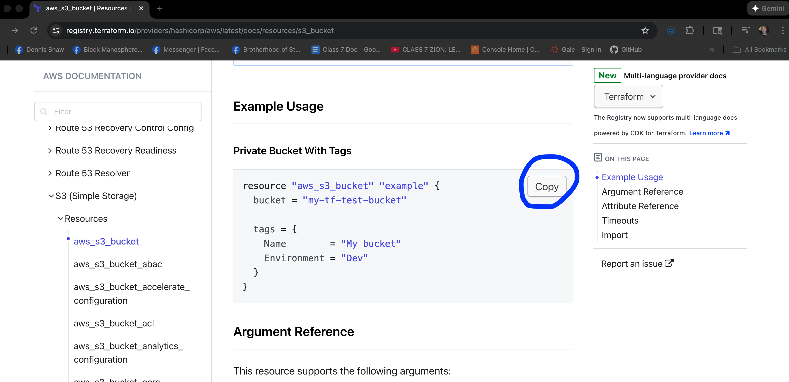

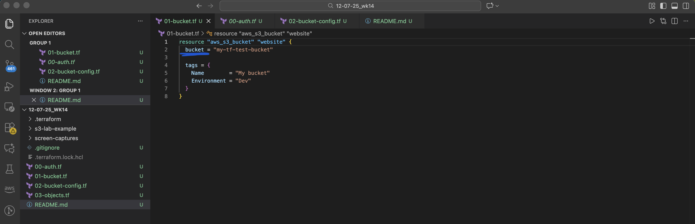

in registry on the right hand side click "Argument Reference" 
- for bucket we will change bucket to bucket_prefix so we get a unique bucket name.

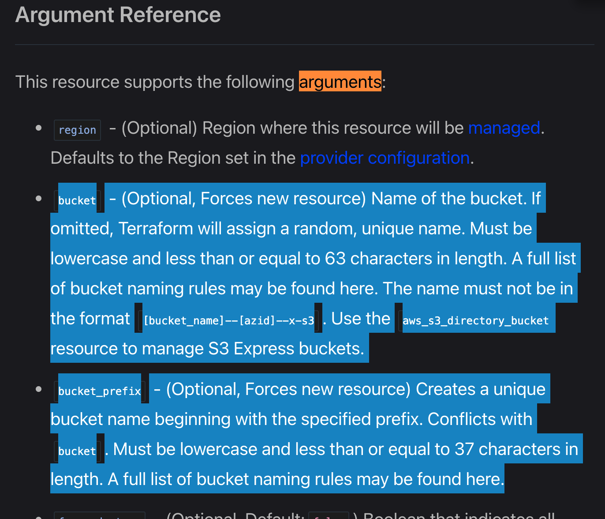

#### next on registry force_destroy
- a good arguments for labs because is says "deleted from the bucket when the bucket is destroyed so that the bucket can be destroyed without error" * in console when you delete a bucket it will tell you it can't until you delete what's in the bucket. If you didn't have force_destroy you would get an error when trying to terraform destroy this lab
- it's a boolean so options are true and false
  
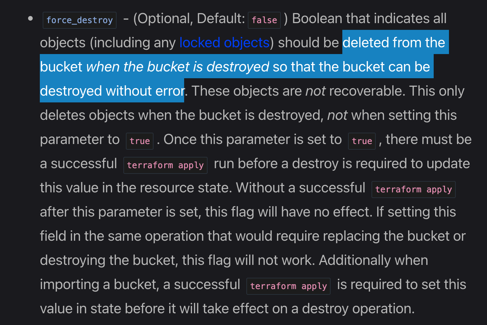

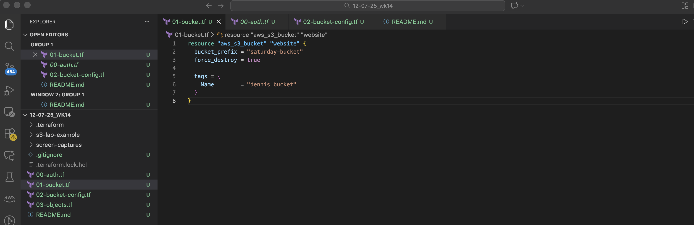

## create these terraform files (.tf)

###     - 02-bucket-config.tf
###     - 03-objects.tf
###     - A-output

- go to registry > provider > documentation > resources > aws_s3_bucket_website_configuration

*you can double check by clicking the link in the registry and going to the AWS documentation

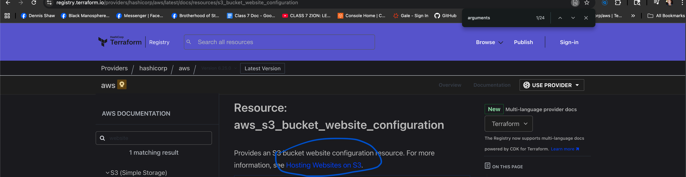

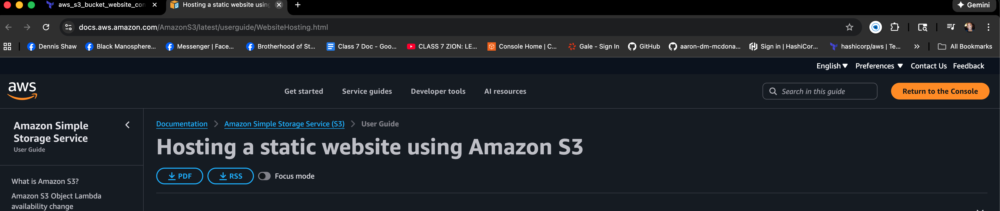

copy the first example usage and past it in 02-bucket-configuration.tf
* we didn't use routing rules or redirect so erase those

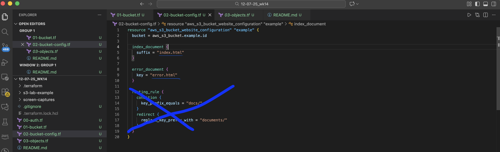

- name the resource and the bucket
- the index.html and error.html will be in the root of the bucket
- read through the registry Argument Reference to see if we need anything else *nothing else needed

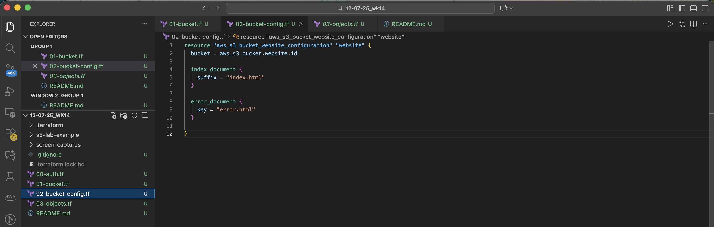

#####
in this section if you click Argument Reference on the right side and go to Atrribute Reference see Website endpoint. We can add this to our A-outhput.tf
#####
 
next as per my own notes we need to do a public access block

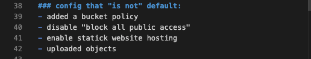

go to registry: 
https://registry.terraform.io/providers/hashicorp/aws/latest/docs/resources/s3_bucket_public_access_block

- again, check the AWS documentation link if you're not sure
- copy the example usage and past in 02-bucket-config.tf
  - change resource and bucket names
  - check the registry's argument reference
  - we need a policy

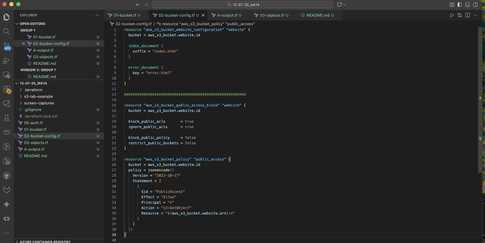

# 03-objects.tf

- got to https://registry.terraform.io/providers/hashicorp/aws/latest/docs/resources/s3_object
- copy example usage and paste in 03-object.tf
- change bucket
- key is the name of the object once its in the bucket
- source is the path to the file that will be read as raw bytes for the object content
- also, we need to give it more information
    - click the argument reference on the right hand side in registry. We've learned that we need to add contenty type because the .html isn't enough for it to know that type because it just sees it as a name. content_type and the MIME type for html file (*see in google search) is "text/html"

output additions

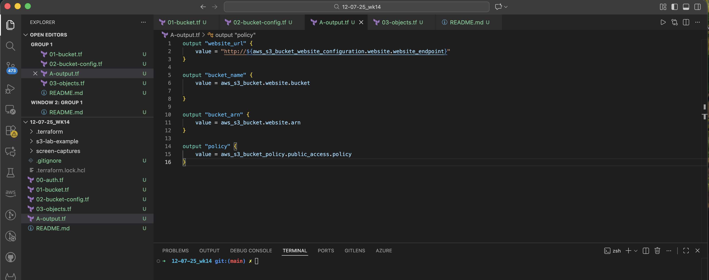